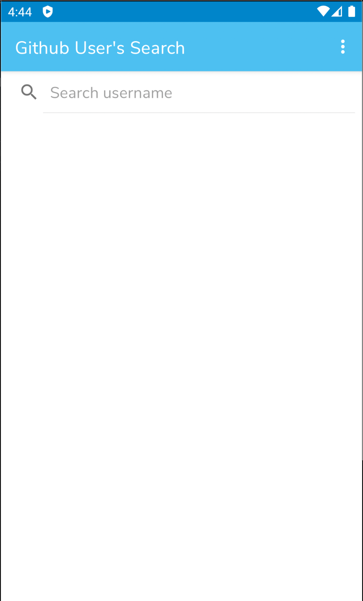
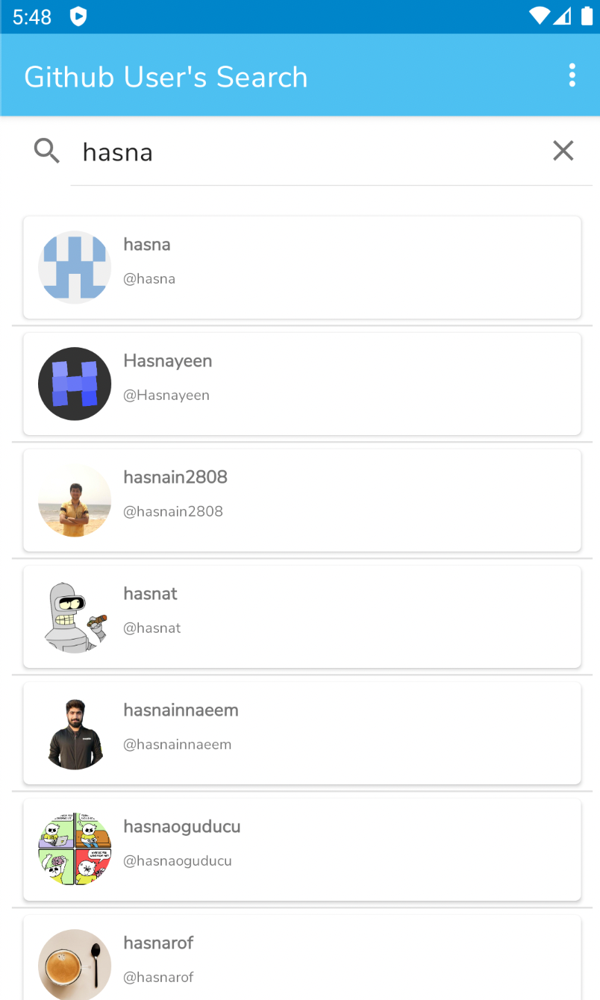
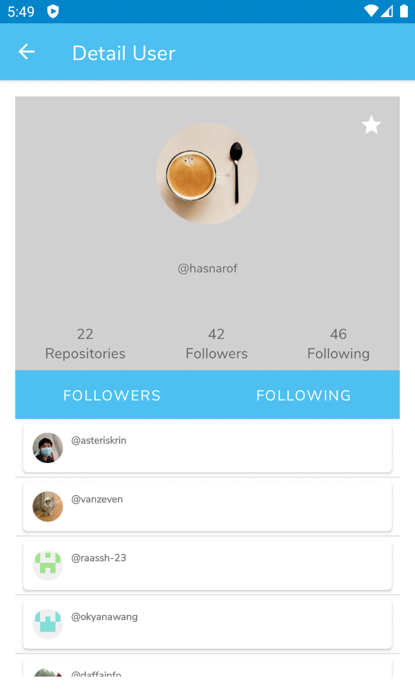
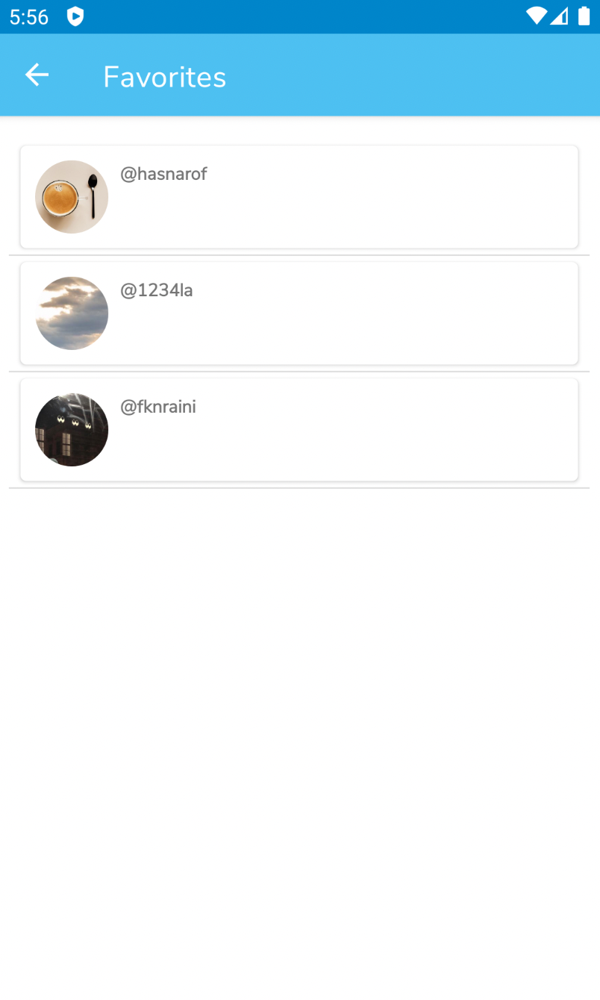
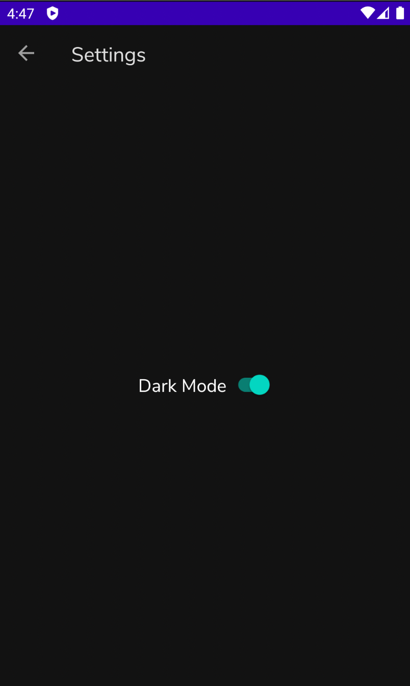

# Bookmark App

This is a bookmark app which can bookmark github users. This project is to complete Dicoding "Fundamental Android Application" course's submissions. There is 3 assignments:

**1st Assignment**
- Show list of github users with RecyclerView.
- If a certain user clicked, show detail user page
- Use ConstraintLayout
- Use Parcelable as interface of data object passing between activities

**2nd Assignment**
- Apply SearchView for user's searching
- Use TabLayout
- Use Retrofit Library to fetch data from API
  
**3rd Assignment**
- Apply CRUD (add, delete, and read bookmarked users) with Room
- Create menu to change theme settings (light/dark), save the settings value in DataStore
- Use ViewModel and LiveData architecture

## Screenshots

  
   
  

  
   

